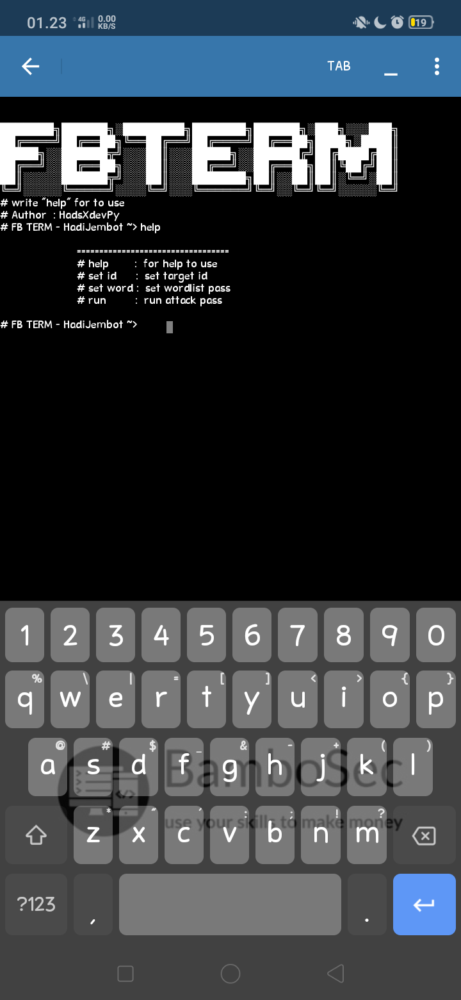

# FB_TERM
### Results 🚀
<p align="center">
  <a name="top" href="#octocat-hi-there-thanks-for-visiting-">
     
  </a>
</p>

# Installation 💢
<details open>
<summary> Android / Linux</summary>

- ```bash
  $ apt update && apt upgrade
  ```

- ```bash
  $ apt install python3 git -y
  ```

- ```bash
  $ git clone https://github.com/HadsXdevPy/FB_TERM
  ```

- ```bash
  $ cd FB_TERM
  ```

- ```bash
  $ python3 main.py
  ```
